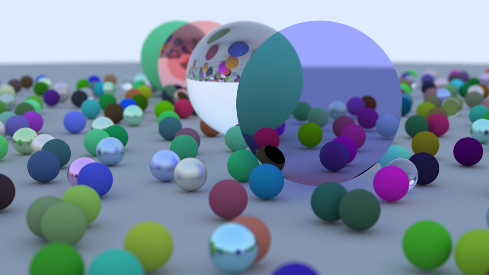

# Ray Tracing in One Weekend

This repository contains an implementation of a simple ray tracer in Rust, following the tutorial [_Ray Tracing in One Weekend_](https://raytracing.github.io/books/RayTracingInOneWeekend.html).



## Features

- Basic path tracing engine
- Sphere and ~~only spheres~~ disks!
- Diffuse and reflective materials

## My Custom Features

- Parallel rendering with Rayon (`--features rayon`)
- Output to png with the Image crate (`--features image`)
- "Portal" material that teleports the ray
- "Blackhole" material that bends the light

## Getting Started

### Prerequisites

- [Rust](https://www.rust-lang.org/tools/install)
- Cargo (comes with a default Rust installation)

### Build & Run

Use the `--release` flag (and maybe also lower the sample count per pixel) or you'll wait ages.

```bash
git clone https://github.com/edwar4rd/ICG_Final_1
cd ICG_Final_1
cargo run --release world
```

The output image will be saved as `image.png`.

## Credits

- Based on the tutorial by Peter Shirley
- README and assisted by GitHub Copilot

## Reference

- [_Ray Tracing in One Weekend_](https://raytracing.github.io/books/RayTracingInOneWeekend.html) by Peter Shirley
- [Create Realistic Black Holes in Blender | Full Tutorial](https://www.youtube.com/watch?v=XWv1Ajc3tfU&t=1870s) (video) by Alaskan FX

## License

This project is released under the [CC0 1.0 Universal (Public Domain Dedication)](https://creativecommons.org/publicdomain/zero/1.0/). You can copy, modify, and distribute this work, even for commercial purposes, without asking permission.

I think this license is appropriate since I didn't did much work outside of translating everything to Rust, and the original tutorial is also in CC0.
